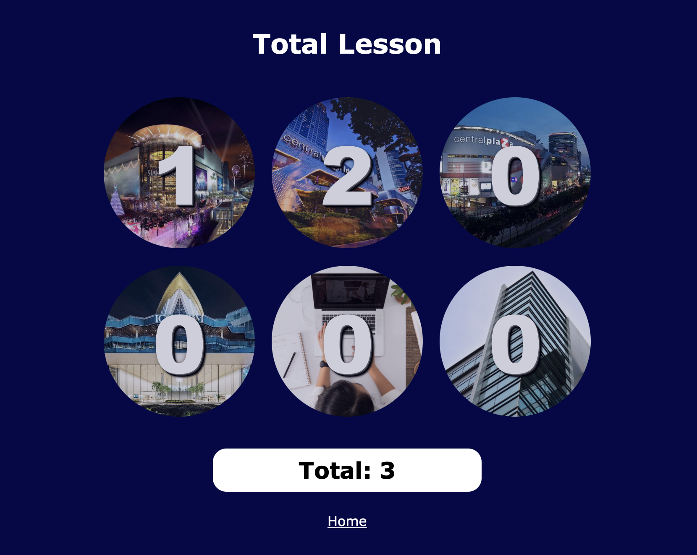

# lesson-taught-calculator
こちらが英語のREADMEファイルになります。[English language](README.md)  
タイにあるModulo語学学校専用の計算機です。HTML、CSS (SASS)、Javascripを使って作りました。

## 目次
* [プロジェクトについて](#プロジェクトについて)
* [使用したテクノロジー](#使用したテクノロジー)
* [使い方](#使い方)
* [スクリーンショット](#スクリーンショット)
* [リリースした日付](#リリースした日付)
* [プロジェクトURL](#プロジェクトurl)
* [第三者から引用したコード](#第三者から引用したコード)
* [コンタクト](#コンタクト)

## プロジェクトについて
教えたレッスンの合計数を計算できる計算機です。Modulo講師はオンラインレッスン、企業出張レッスンに加え、４つの校舎で語学を教えなければなりません。講師が各校舎の合計レッスンを容易に計算できるよう、この計算機を作りました。加えて、CSS設計手法の一つのBEM、SCSS、Javascriptのコーディングの練習、という意味も兼ねてこの計算機を作りました。

## 使用したテクノロジー
- HTML5
- CSS3
- SASS 3.5.6 (SCSS 構文)
- BEM (CSS 設計思想)
- JavaScript ES6

## 使い方
レッスン数を各欄に入力してください。次に ”Calculate” ボタンを押してください。最後に”Save” ボタンを押して合計数を保存してください。お持ちのデバイスのスクリーンが横幅700ピクセル以上の場合は、バブルアニメーションが画面全体に表示されます。”Save” ボタンを押すと各レッスン数が自動でlocalStorageに保存されます。ですので、ブラウザーをリフレッシュした場合でもデータ（セーブしたレッスン数）が消えることがありません。この計算機はモバイルフレンドリー、更に、主要なブラウザー（Chrome, FireFox, Edgeなど）全てに対応しています。お好きなデバイス、ブラウザーをお使いください。

## スクリーンショット

## リリースした日付
- 初めのリリース: 2021年、8月15日（ Netlifyにて (https://www.netlify.com)

## プロジェクトURL
https://lessons-taught-calc.netlify.app

## 第三者から引用したコード
- バブルアニメーション（ codePen: https://codepen.io)

## コンタクト
[Kinta Nakai](https://www.linkedin.com/in/kinta-nakai-756b0b144) - 連絡お待ちしております！