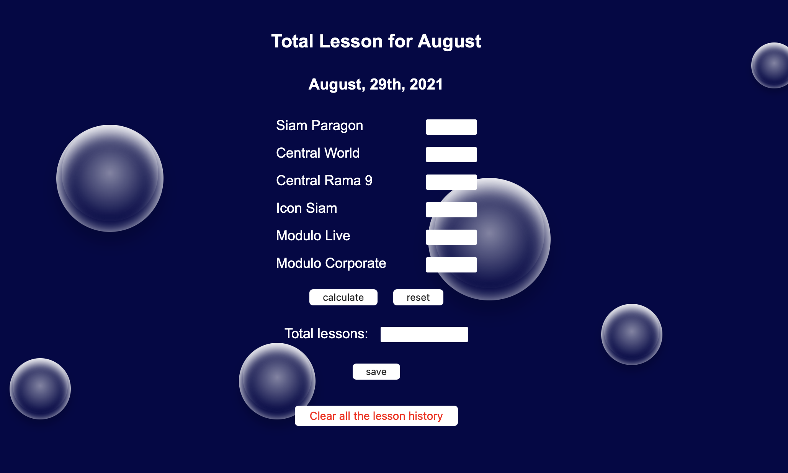
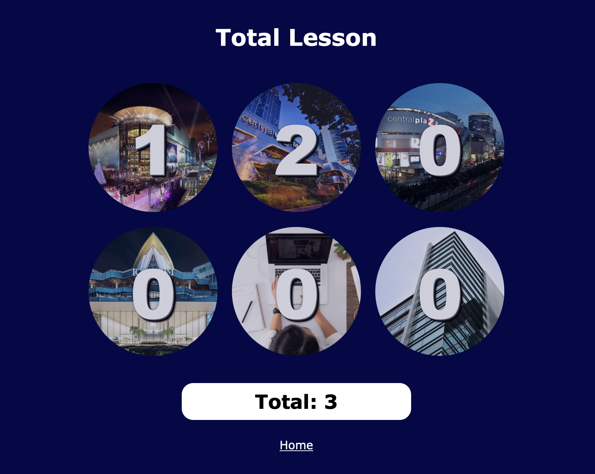

# lesson-taught-calculator
Here is the same README for [Japanese language](README-JP.md).  
Simple calculator for Modulo Language School in Thailand created with HTML, CSS (SASS), and JavaScript.
## Table of Contents
* General Information
* Used Technologies
* How to Use
* Screenshots
* Released Date
* Project URL
* Third Party Code
* Contact

## General Information
The calculator has created to make Modulo employees easy to calculate total lessons. In addtion to online teaching and teaching at firm, there are 4 branches at the school. This made us difficult to calculate each branch's lesson by our own. Also, The calculator has made for me to practice CSS methodology **BEM** together with **SCSS** and **JavaScript**.

## Used Technologies
- HTML5
- CSS3
- SASS 3.5.6 (SCSS syntax)
- BEM (CSS Methodology)
- JavaScript ES6

## How to Use
Enter a lesson you taught in each column, click the 'calculate' button, and save your total with the 'save' button. If your device's screen has more than 700px wide, bubble animation pops up. You will not lose any data (saved lessons) even if you refresh the browser because every lesson will be saved to localStorage after you save with the 'save' button. The calculator is mobile friendly and also compatible with all the major, modern browsers such as Chrome, FireFox, Edge etc.

## Screenshots

## Released Date
- first release: August 15th, 2021 on Netlify (https://www.netlify.com)

## Project URL
https://lessons-taught-calc.netlify.app

## Third Party Code
- bubble animation, by codePen (https://codepen.io)

## Contact
[Kinta Nakai](https://www.linkedin.com/in/kinta-nakai-756b0b144) - feel free to contact me!